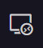

# VSCode EOS Remote Setup
This is a short guide that will help new students get connected to EOS with the VSCode remote extension which can make development on EOS 100 times easier.

## Download the VPN
If you have not already installed the GVSU VPN instructions can be found at the link below.
- [VPN Instructions](https://www.gvsu.edu/it/downloading-installing-and-setting-up-pulse-secure-222.htm)

## Getting VSCode setup
There are just a few small steps needed in order to get started.
- [Install the extension](https://marketplace.visualstudio.com/items?itemName=ms-vscode-remote.remote-ssh)
- After installing there should be a new icon on the left side of your vscode.  Click 
this and a new side tab should show up
- Click on the plus button to add a new SSH connection 
- You will then be asked to add a new ssh connection command 
- Enter the following: `ssh [GVSU Username]@eos[EOS Number].cis.gvsu.edu` Example: `ssh strohscd@eos12.cis.gvsu.edu`
- You will then be asked to select a configuration file to update. You can just update the top one in the list.
- You will now see the remote in the ssh targets list. Click the small folder with a plus to connect. 
- At this time you will need to select confirm on the ssh fingerprint validation and enter your password. If you fail to connect make sure the VPN is running and your ssh connection string is correct.
- The new VSCode window that opens will be connected to the remote machine. You can start by doing `File > Open Folder` to open a folder on your EOS machine.

### Helpful Hints
- Make sure the VPN is always ON and connected.
- You can open a terminal with `ctrl + shift + ~`
